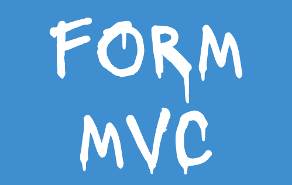
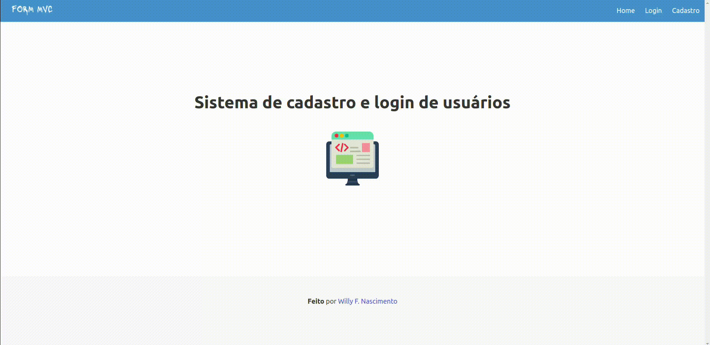

# Sistema-de-usuario

# 


Sistema feito em node Js que faz cadastro e login de um usuário. A escrita e leitura é feita pelo arquivo <strong style="color: yellow">User.js</strong> que altera o arquivo <strong style="color: yellow">users.json</strong>. As funções desse arquivo são chamadas nos controllers. Em resumo, o arquivo <strong style="color: yellow">users.json</strong> simula um bando de dados.

## 🛠️ Construído com

Tecnologias utilizadas no projeto:

* [](https://nodejs.org/en/docs)
* [](https://bulma.io/documentation/)
* [](https://www.npmjs.com/package/npm?activeTab=versions) 

Pacotes NPM utilizados:

* [](https://www.npmjs.com/package/bcrypt)
* [](https://www.npmjs.com/package/cookie-parser)
* [](https://www.npmjs.com/package/debug)
* [](https://www.npmjs.com/package/ejs)
* [](https://www.npmjs.com/package/express)
* [](https://www.npmjs.com/package/express-session)
* [](https://www.npmjs.com/package/express-validator)
* [](https://www.npmjs.com/package/http-errors)
* [](https://www.npmjs.com/package/morgan)
* [](https://www.npmjs.com/package/multer)
* [](https://www.npmjs.com/package/nodemon)
 
## ⚙️ Projeto funcionando

### Cadastrando usuário
<p align="center">
  
</p>

### Usuário logando
<p align="center">
  
</p>

## 🚀 Começando

Para executar esse projeto no seu ambiente, tenha o
<strong href="https://nodejs.org/en">Node JS</strong> instalado, do contrario, não conseguira executar.

### 📋 Pré-requisitos
[](https://nodejs.org/en/docs)

## Browser Support

- Chrome
- Edge
- Firefox
- Opera
- Safari


### 🔧 Instalação

Passo a passo para baixar e executar o projeto no seu ambiente.

Baixe o repositório do github:

```
git clone https://github.com/will27nasc/Sistema-de-usuario.git
```

Baixe todos os pacotes especificados na dependência:

```
npm install
```

Execute o projeto:

```
npm run start
```

## ✒️ Autores

* **Desenvolvedor** - *Trabalho e documentação* - [Willy F. Nascimento](https://github.com/will27nasc)

## 📄 Licença

Este projeto está sob a licença (will27nasc/Sistema-de-usuario) - veja o arquivo [LICENSE.md](https://github.com/will27nasc/Sistema-de-usuario/blob/main/LICENSE) para detalhes.

